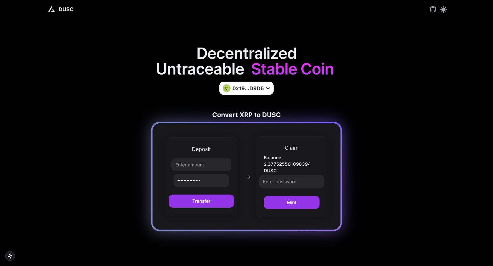

# Decentralized Untraceable Stable Coin (DUSC)





[SMART CONTRACTS REPO](https://github.com/Purva-Chaudhari/DUSC)

## Technologies Used

- [Next.js 14](https://nextjs.org/docs/getting-started)
- [HeroUI v2](https://heroui.com/)
- [Tailwind CSS](https://tailwindcss.com/)
- [Tailwind Variants](https://tailwind-variants.org)
- [TypeScript](https://www.typescriptlang.org/)
- [Framer Motion](https://www.framer.com/motion/)
- [next-themes](https://github.com/pacocoursey/next-themes)

## How to Use


### Install dependencies

You can use one of them `npm`, `yarn`, `pnpm`, `bun`, Example using `npm`:

```bash
npm install
```

### Run the development server

```bash
npm run dev
```

### Setup env variables


```bash
CONTRACT_ADDRESS=0x36C126f4D8c30a77a29E6Ff4416c5AdD1b622dE0

RPC=https://rpc-evm-sidechain.xrpl.org

SEMAPHORE_CONTRACT=0x825891672a3087A3f966F1d48E17F1A623642902
```

After modifying the `.npmrc` file, you need to run `pnpm install` again to ensure that the dependencies are installed correctly.

## License

Licensed under the [MIT license](https://github.com/heroui-inc/next-app-template/blob/main/LICENSE).
